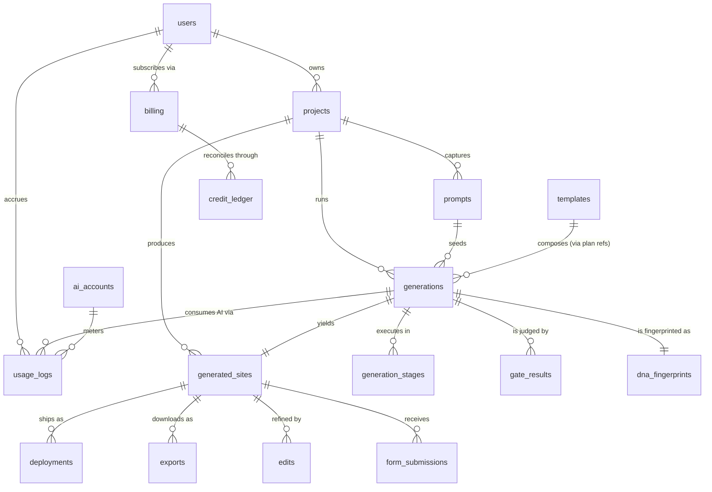

# SiteForge — Database Schema & ERD

Authoritative schema for the platform. PostgreSQL 16. This document supersedes
the abridged sketch in [`DATA_MODEL.md`](DATA_MODEL.md) §1; that document
remains authoritative for the niche taxonomy, artifact schemas, API surface,
and storage layout.

**Conventions**

- Primary keys: `id uuid` (UUIDv7 — time-ordered, index-friendly at scale).
- Every table: `created_at timestamptz not null default now()`; mutable tables
  add `updated_at`.
- Soft delete via `deleted_at timestamptz` where user data is involved.
- Tenancy: every user-owned row carries `user_id` (workspace-scoping arrives
  with teams in Phase 2 as an additive `workspace_id`).
- Pipeline artifacts are `jsonb`, validated by versioned zod schemas at the
  application layer (`artifact_schema_ver` column alongside).
- No cross-service foreign keys to external systems — Stripe/Vercel/etc. refs
  are opaque `text`/`jsonb`.

---

## 1. Entity-relationship diagram



Core tables are the eleven the platform is specified around; the auxiliary
tables (`generation_stages`, `gate_results`, `dna_fingerprints`, `edits`,
`form_submissions`, `credit_ledger`) exist to keep the core tables narrow and
hot-path fast.

---

## 2. Core tables

### 2.1 `users`

```sql
users (
  id              uuid PRIMARY KEY,
  email           citext UNIQUE NOT NULL,
  name            text,
  avatar_url      text,
  auth_provider   text NOT NULL,            -- otp | google | github
  role            text NOT NULL DEFAULT 'user',   -- user | admin
  status          text NOT NULL DEFAULT 'active', -- active | suspended
  locale          text DEFAULT 'en',
  last_seen_at    timestamptz,
  created_at      timestamptz NOT NULL DEFAULT now(),
  updated_at      timestamptz,
  deleted_at      timestamptz
)
-- INDEX: (email), (status) partial WHERE deleted_at IS NULL
```

Passwordless: no password column exists. OTP codes and refresh sessions live
in small auxiliary tables (`otp_codes`, `sessions`) with aggressive TTL
cleanup; they are operational, not part of the domain model.

### 2.2 `projects`

A project is a business the user is building a site for. One project holds
many prompts/generations over time and points at its current live site.

```sql
projects (
  id               uuid PRIMARY KEY,
  user_id          uuid NOT NULL REFERENCES users(id),
  name             text NOT NULL,
  niche_id         text NOT NULL,            -- taxonomy node (DATA_MODEL §2)
  business_facts   jsonb NOT NULL DEFAULT '{}',  -- name, address, hours, services…
  current_site_id  uuid,                     -- → generated_sites, nullable
  status           text NOT NULL DEFAULT 'active',
  created_at       timestamptz NOT NULL DEFAULT now(),
  updated_at       timestamptz,
  deleted_at       timestamptz
)
-- INDEX: (user_id, created_at DESC) WHERE deleted_at IS NULL
```

### 2.3 `prompts`

The immutable record of what the user asked for: wizard selections plus any
free text. Kept separate from `generations` because one prompt can seed many
generations (re-rolls, tier upgrades) and prompts are the product-analytics
goldmine (what people ask for vs. what ships).

```sql
prompts (
  id             uuid PRIMARY KEY,
  project_id     uuid NOT NULL REFERENCES projects(id),
  user_id        uuid NOT NULL REFERENCES users(id),
  niche_text     text NOT NULL,          -- raw user input
  niche_id       text NOT NULL,          -- resolved taxonomy node
  archetype_id   text NOT NULL,          -- chosen style (DESIGN_DNA §2)
  mood           jsonb NOT NULL,         -- slider positions
  tier           text NOT NULL,          -- standard | premium | signature
  free_text      text,                   -- optional user brief
  source         text NOT NULL DEFAULT 'wizard',  -- wizard | edit | api
  created_at     timestamptz NOT NULL DEFAULT now()
)
-- INDEX: (project_id, created_at DESC)
```

### 2.4 `templates`

The versioned Design-DNA registry, synced from the in-repo curated content:
archetypes, section patterns, font pairings, motion dialects. One table,
discriminated by `kind`, because they version and sync identically.

```sql
templates (
  id           text NOT NULL,            -- e.g. 'hero/editorial-split'
  version      int  NOT NULL,
  kind         text NOT NULL,            -- archetype | pattern | pairing | dialect
  definition   jsonb NOT NULL,           -- rules / variant axes / affinities
  status       text NOT NULL DEFAULT 'active',  -- active | deprecated
  checksum     text NOT NULL,
  created_at   timestamptz NOT NULL DEFAULT now(),
  PRIMARY KEY (id, version)
)
-- INDEX: (kind, status)
```

Generated sites pin exact `(id, version)` pairs (see `generated_sites.
template_versions`) so a site republishes byte-stable regardless of library
evolution. Deprecated versions are never deleted while any site pins them.

### 2.5 `generations`

One pipeline run. Narrow and hot — heavy per-stage data lives in
`generation_stages`.

```sql
generations (
  id             uuid PRIMARY KEY,
  project_id     uuid NOT NULL REFERENCES projects(id),
  prompt_id      uuid NOT NULL REFERENCES prompts(id),
  user_id        uuid NOT NULL REFERENCES users(id),
  tier           text NOT NULL,
  status         text NOT NULL,          -- queued | running | gating | repairing
                                         -- | succeeded | failed | canceled
  current_stage  text,
  error          jsonb,
  cost_cents     int  NOT NULL DEFAULT 0,   -- rolled up from usage_logs
  wall_ms        int,
  created_at     timestamptz NOT NULL DEFAULT now(),
  finished_at    timestamptz
)
-- INDEX: (project_id, created_at DESC), (status) partial WHERE status IN
--        ('queued','running','gating','repairing'), (user_id, created_at DESC)
```

### 2.6 `generated_sites`

The output artifact: a complete, gated, deployable site version. Append-only —
every successful generation or accepted edit creates a new row; `projects.
current_site_id` points at the live one.

```sql
generated_sites (
  id                 uuid PRIMARY KEY,
  project_id         uuid NOT NULL REFERENCES projects(id),
  generation_id      uuid NOT NULL REFERENCES generations(id) UNIQUE,
  bundle_key         text NOT NULL,      -- S3: built static output
  source_key         text NOT NULL,      -- S3: Astro source
  design_tokens      jsonb NOT NULL,     -- the DesignTokens artifact
  template_versions  jsonb NOT NULL,     -- pinned {templateId: version}
  page_manifest      jsonb NOT NULL,     -- paths, titles, section maps
  status             text NOT NULL DEFAULT 'draft',  -- draft | published | archived
  published_at       timestamptz,
  created_at         timestamptz NOT NULL DEFAULT now()
)
-- INDEX: (project_id, created_at DESC), (status)
```

### 2.7 `deployments`

```sql
deployments (
  id                 uuid PRIMARY KEY,
  generated_site_id  uuid NOT NULL REFERENCES generated_sites(id),
  user_id            uuid NOT NULL REFERENCES users(id),
  target             text NOT NULL,      -- managed | vercel | netlify
  target_ref         jsonb,              -- provider ids, opaque
  url                text,
  custom_domain      text,
  status             text NOT NULL,      -- pending | live | failed | retired
  error              jsonb,
  created_at         timestamptz NOT NULL DEFAULT now(),
  live_at            timestamptz,
  retired_at         timestamptz
)
-- INDEX: (generated_site_id, created_at DESC), (custom_domain) UNIQUE
--        partial WHERE status = 'live'
```

### 2.8 `ai_accounts`

The model-provider account pool the orchestrator routes through. Multiple
accounts per provider spread rate limits, isolate tiers, and give clean
failover; keys themselves live in the secrets vault — the DB stores only a
reference.

```sql
ai_accounts (
  id               uuid PRIMARY KEY,
  provider         text NOT NULL,        -- anthropic | openai | stock-imagery | …
  label            text NOT NULL,        -- 'anthropic-prod-2'
  key_ref          text NOT NULL,        -- vault path, never the key
  model_allowlist  text[] NOT NULL,
  tier_affinity    text[],               -- which product tiers may use it
  rpm_limit        int,
  tpm_limit        bigint,
  monthly_budget_cents int,
  spent_cents_mtd  int NOT NULL DEFAULT 0,
  health           text NOT NULL DEFAULT 'healthy', -- healthy | degraded | disabled
  last_error       jsonb,
  created_at       timestamptz NOT NULL DEFAULT now(),
  updated_at       timestamptz
)
-- INDEX: (provider, health)
```

Live rate-limit counters are in Redis (token buckets keyed by account id);
Postgres holds configuration and slow-moving state (budget, health).

### 2.9 `usage_logs`

Per-call metering for every AI/provider invocation. High volume →
**partitioned by month**, insert-only, rolled up nightly into
`usage_daily_rollups` for dashboards; raw partitions detached and archived to
object storage after 6 months.

```sql
usage_logs (
  id             uuid,
  occurred_at    timestamptz NOT NULL,
  user_id        uuid,
  generation_id  uuid,
  stage          text,                    -- brief | tokens | plan | copy | …
  ai_account_id  uuid NOT NULL,
  model          text NOT NULL,
  tokens_in      int NOT NULL DEFAULT 0,
  tokens_out     int NOT NULL DEFAULT 0,
  cost_cents     numeric(10,4) NOT NULL,
  latency_ms     int,
  outcome        text NOT NULL,           -- ok | rate_limited | error | timeout
  PRIMARY KEY (occurred_at, id)
) PARTITION BY RANGE (occurred_at)
-- INDEX per partition: (generation_id), (ai_account_id, occurred_at),
--                      (user_id, occurred_at)
```

### 2.10 `billing`

The subscription/plan record per user (per workspace in Phase 2). Money
*movements* go through the append-only `credit_ledger`; `billing` holds the
current commercial relationship.

```sql
billing (
  id                    uuid PRIMARY KEY,
  user_id               uuid NOT NULL REFERENCES users(id) UNIQUE,
  plan                  text NOT NULL DEFAULT 'free',  -- free | pro | studio
  stripe_customer_id    text UNIQUE,
  stripe_subscription_id text,
  status                text NOT NULL DEFAULT 'active', -- active | past_due
                                                        -- | canceled | trialing
  credits_balance       int NOT NULL DEFAULT 0,   -- cached; ledger is truth
  period_started_at     timestamptz,
  period_ends_at        timestamptz,
  created_at            timestamptz NOT NULL DEFAULT now(),
  updated_at            timestamptz
)

credit_ledger (           -- auxiliary, append-only source of truth
  id             uuid PRIMARY KEY,
  billing_id     uuid NOT NULL REFERENCES billing(id),
  delta          int NOT NULL,            -- +grant / −generation / +refund
  reason         text NOT NULL,
  generation_id  uuid,
  balance_after  int NOT NULL,
  created_at     timestamptz NOT NULL DEFAULT now()
)
-- INDEX: (billing_id, created_at DESC)
```

Failed generations auto-refund via the ledger. `credits_balance` is a cache
maintained transactionally with ledger inserts; a nightly job asserts
cache == ledger sum.

### 2.11 `exports`

```sql
exports (
  id                 uuid PRIMARY KEY,
  generated_site_id  uuid NOT NULL REFERENCES generated_sites(id),
  user_id            uuid NOT NULL REFERENCES users(id),
  format             text NOT NULL,      -- zip-static | zip-source
  storage_key        text,               -- S3 key of the packaged export
  status             text NOT NULL,      -- pending | ready | expired | failed
  download_count     int NOT NULL DEFAULT 0,
  expires_at         timestamptz,        -- signed-URL window (72 h)
  created_at         timestamptz NOT NULL DEFAULT now()
)
-- INDEX: (user_id, created_at DESC), (status, expires_at)
```

---

## 3. Auxiliary tables (unchanged from DATA_MODEL.md)

`generation_stages` (per-stage artifacts + caching hashes), `gate_results`,
`dna_fingerprints`, `edits`, `form_submissions`, `otp_codes`, `sessions`.
`generation_stages` and `gate_results` are the second-largest write paths
after `usage_logs`; both are partitioned by month on `created_at` with the
same archive policy.

---

## 4. Relationship summary

| Relationship | Cardinality | Notes |
|---|---|---|
| users → projects | 1 : N | tenancy root; all queries scoped by `user_id` |
| users → billing | 1 : 1 | per-workspace in Phase 2 |
| projects → prompts | 1 : N | immutable request history |
| prompts → generations | 1 : N | re-rolls reuse the prompt |
| projects → generations | 1 : N | denormalized for hot dashboard queries |
| generations → generated_sites | 1 : 0..1 | only `succeeded` generations yield a site |
| generations → generation_stages | 1 : N | one row per stage attempt |
| generations → gate_results | 1 : N | one row per gate per page |
| generations → dna_fingerprints | 1 : 1 | uniqueness gate input |
| templates → generations | M : N | via pinned refs in plan/site jsonb, not a join table — pins are immutable snapshots, not live links |
| ai_accounts → usage_logs | 1 : N | metering + budget rollups |
| generations → usage_logs | 1 : N | per-stage cost attribution |
| generated_sites → deployments | 1 : N | multiple targets per site version |
| generated_sites → exports | 1 : N | |
| billing → credit_ledger | 1 : N | append-only money truth |

Deliberate denormalizations: `user_id` on `generations`/`deployments`/
`exports` (skip joins on the hottest dashboard queries and make row-level
scoping trivial); `credits_balance` cache on `billing`; `cost_cents` rollup
on `generations`.

---

## 5. Integrity & lifecycle rules

- `projects.current_site_id` may only point at a `generated_sites` row of the
  same project with `status IN ('draft','published')` — enforced at the
  service layer plus a deferred constraint trigger.
- A `generated_sites` row is immutable after creation except `status`/
  `published_at`; edits create a new generation → new site row.
- User deletion: soft-delete → 30-day grace → hard purge of rows + S3
  prefixes; `usage_logs`/`credit_ledger` rows are retained but anonymized
  (`user_id → NULL`) for financial audit.
- `templates` rows are never mutated — new behavior is a new `version`;
  `checksum` guards against registry-sync drift.
